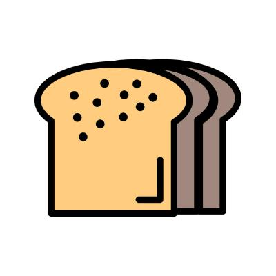
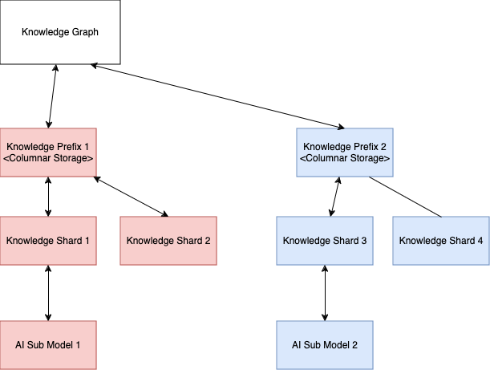
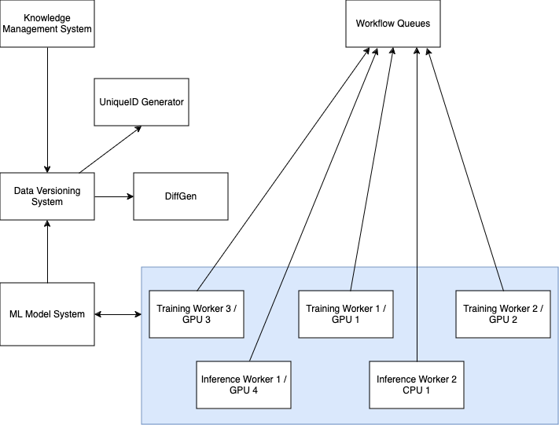

# Breadcrumb AI

 Work in Progress. 👷‍♂️ 

## Basic Idea

Breadcrumb AI is based on the idea is that knowledge can be partitioned, a
subset of it can be sliced and cut, into teeny weeny independant portions
and fed into smaller computers to learn and turn into tiny AI models
which are highly specialized in an area of knowledge.

## High Level Architecture

### Federated Knowledge Repository

To that goal, we are in the early stages of designing and doing PoCs for the
[Document Repo](https://github.com/BreadcrumbAI/DocRepo), where we will hold
the initial corpus of data to consume.

What we are looking to build is a fully versioned, fully transparent knowledge
repository, with full attribution to sources during training. To that end, we
are outlining our vision in building this for everyone.

This is how we envision we will be utilizing our Knowledge Graph to build
an editable, auditable and attributable dataset:

### Modular Training Workers

To further advance the state of the art for training, we are looking to
create easy trainers/fine tuners that would take a Breadcrumb, and train
the AI to answer questions on such a dataset easily.

This is depicted here:

.

We will also be building a [Workflow Server](https://github.com/BreadcrumbAI/Workflow)
which is used to periodically instrument, observe and predict/estimate when
a full Knowledge Graph can be reasonably trained by the network into a model.

## Feedback

Comments are welcome. Suggestions, Resources, Code, PRs welcome.

Visit our [GitHub Page](https://github.com/BreadcrumbAI) on how to contact us.
